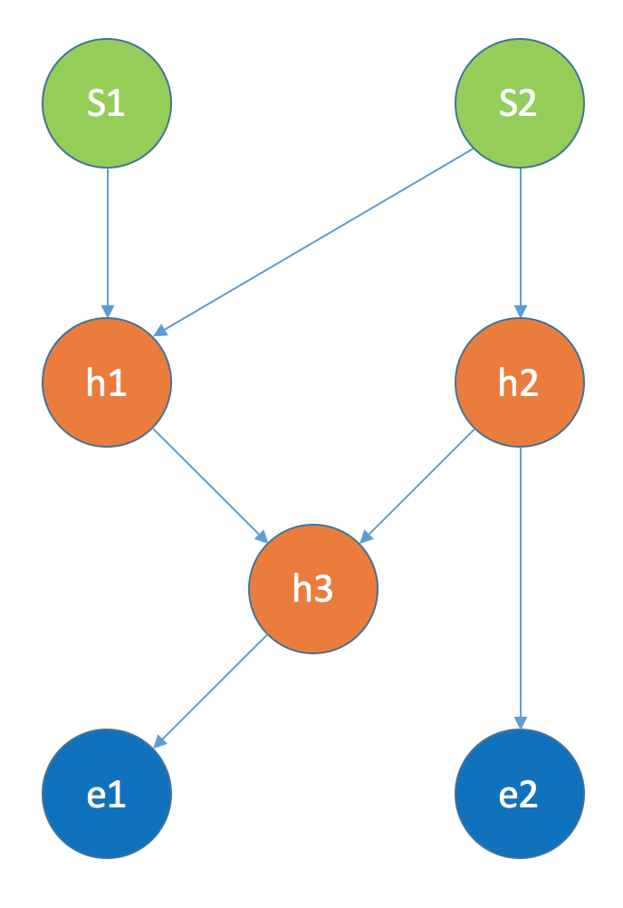
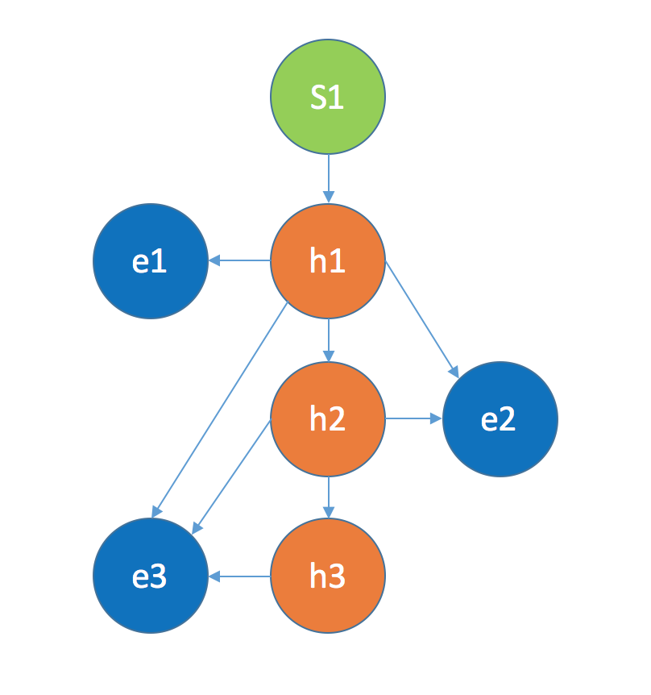
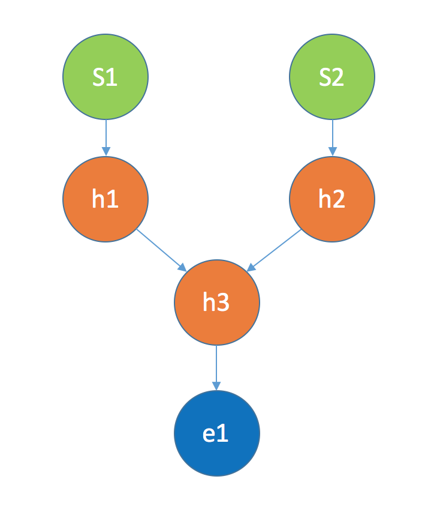

# TensorGraph
TensorGraph is a framework for building any imaginable models based on TensorFlow.

As deep learning becomes more and more common and the architectures becoming more
and more complicated, it seems that we need some easy to use framework to quickly
build these models and that's why TensorGraph is born. It's a very simple and easy
to use framework, but it allows you to build all kinds of imaginable models.

-----
### Install

First you need to install [tensorflow](https://www.tensorflow.org/versions/r0.9/get_started/os_setup.html)

To install tensorgraph simply do via pip
```bash
sudo pip install tensorgraph
```
or for bleeding edge version do
```bash
sudo pip install --upgrade git+https://github.com/hycis/TensorGraph.git@master
```
or simply clone and add to `PYTHONPATH`.
```bash
git clone https://github.com/hycis/TensorGraph.git
export PYTHONPATH=/path/to/TensorGraph:$PYTHONPATH
```
in order for the install to persist via export `PYTHONPATH`. Add `PYTHONPATH=/path/to/TensorGraph:$PYTHONPATH` to your `.bashrc` for linux or
`.bash_profile` for mac. While this method works, you will have to ensure that
all the dependencies in [setup.py](setup.py) are installed.

-----
### How TensorGraph Works?
In TensorGraph, we defined three types of nodes

1. StartNode : for inputs to the graph
2. HiddenNode : for putting sequential layers inside
3. EndNode : for getting outputs from the model

We put all the sequential layers into a `HiddenNode`, and connect the hidden nodes
together to build all kinds of architectures without worrying about how to design
the forward propagation. We let the graph engine sort out all the forward propagations
for you, so that you just focus on designing the architecture. The graph always
starts with `StartNode` and ends with `EndNode`. Below shows an
[example](examples/example.py) of building a tensor graph.

-----
### Graph Example



First define the `StartNode` for putting the input placeholder
```python
y1_dim = 50
y2_dim = 100
batchsize = 32
learning_rate = 0.01

y1 = tf.placeholder('float32', [None, y1_dim])
y2 = tf.placeholder('float32', [None, y2_dim])
s1 = StartNode(input_vars=[y1])
s2 = StartNode(input_vars=[y2])
```
Then define the `HiddenNode` for putting the sequential layers in each `HiddenNode`
```python
h1 = HiddenNode(prev=[s1, s2],
                input_merge_mode=Concat(),
                layers=[Linear(y1_dim+y2_dim, y2_dim), RELU()])
h2 = HiddenNode(prev=[start2],
                layers=[Linear(y2_dim, y2_dim), RELU()])
h3 = HiddenNode(prev=[h1, h2],
                input_merge_mode=Sum(),
                layers=[Linear(y2_dim, y1_dim), RELU()])
```
Then define the `EndNode`. `EndNode` is used to back-trace the graph to connect
the nodes together.
```python
e1 = EndNode(prev=[h3])
e2 = EndNode(prev=[h2])
```
Finally build the graph by putting `StartNodes` and `EndNodes` into `Graph`
```python
graph = Graph(start=[s1, s2], end=[e1, e2])
```
Run train forward propagation to get symbolic output from train mode. The number
of outputs from `graph.train_fprop` is the same as the number of `EndNodes` put
into `Graph`
```python
o1, o2 = graph.train_fprop()
```
Finally build an optimizer to optimize the objective function
```python
o1_mse = tf.reduce_mean((y1 - o1)**2)
o2_mse = tf.reduce_mean((y2 - o2)**2)
mse = o1_mse + o2_mse
optimizer = tf.train.AdamOptimizer(learning_rate).minimize(mse)
```
-----
### Hierachical Softmax Example
Below is another example for building a more powerful [hierachical softmax](examples/hierachical_softmax.py)
whereby the lower hierachical softmax layer can be conditioned on all the upper
hierachical softmax layers.



```python
## params
x_dim = 50
component_dim = 100
batchsize = 32
learning_rate = 0.01


x_ph = tf.placeholder('float32', [None, x_dim])
# the three hierachical level
y1_ph = tf.placeholder('float32', [None, component_dim])
y2_ph = tf.placeholder('float32', [None, component_dim])
y3_ph = tf.placeholder('float32', [None, component_dim])

# define the graph model structure
start = StartNode(input_vars=[x_ph])

h1 = HiddenNode(prev=[start], layers=[Linear(x_dim, component_dim), Softmax()])
h2 = HiddenNode(prev=[h1], layers=[Linear(component_dim, component_dim), Softmax()])
h3 = HiddenNode(prev=[h2], layers=[Linear(component_dim, component_dim), Softmax()])


e1 = EndNode(prev=[h1], input_merge_mode=Sum())
e2 = EndNode(prev=[h1, h2], input_merge_mode=Sum())
e3 = EndNode(prev=[h1, h2, h3], input_merge_mode=Sum())

graph = Graph(start=[start], end=[e1, e2, e3])

o1, o2, o3 = graph.train_fprop()

o1_mse = tf.reduce_mean((y1_ph - o1)**2)
o2_mse = tf.reduce_mean((y2_ph - o2)**2)
o3_mse = tf.reduce_mean((y3_ph - o3)**2)
mse = o1_mse + o2_mse + o3_mse
optimizer = tf.train.AdamOptimizer(learning_rate).minimize(mse)
```

-----
### Transfer Learning Example
Below is an example on transfer learning with bi-modality inputs and merge at
the middle layer with shared representation, in fact, TensorGraph can be used
to build any number of modalities for transfer learning.



```python
## params
x1_dim = 50
x2_dim = 100
shared_dim = 200
y_dim = 100
batchsize = 32
learning_rate = 0.01


x1_ph = tf.placeholder('float32', [None, x1_dim])
x2_ph = tf.placeholder('float32', [None, x2_dim])
y_ph = tf.placeholder('float32', [None, y_dim])

# define the graph model structure
s1 = StartNode(input_vars=[x1_ph])
s2 = StartNode(input_vars=[x2_ph])

h1 = HiddenNode(prev=[s1], layers=[Linear(x1_dim, shared_dim), RELU()])
h2 = HiddenNode(prev=[s2], layers=[Linear(x2_dim, shared_dim), RELU()])
h3 = HiddenNode(prev=[h1,h2], input_merge_mode=Sum(),
                layers=[Linear(shared_dim, y_dim), Softmax()])

e1 = EndNode(prev=[h3])

graph = Graph(start=[s1, s2], end=[e1])
o1, = graph.train_fprop()

mse = tf.reduce_mean((y_ph - o1)**2)
optimizer = tf.train.AdamOptimizer(learning_rate).minimize(mse)
```
