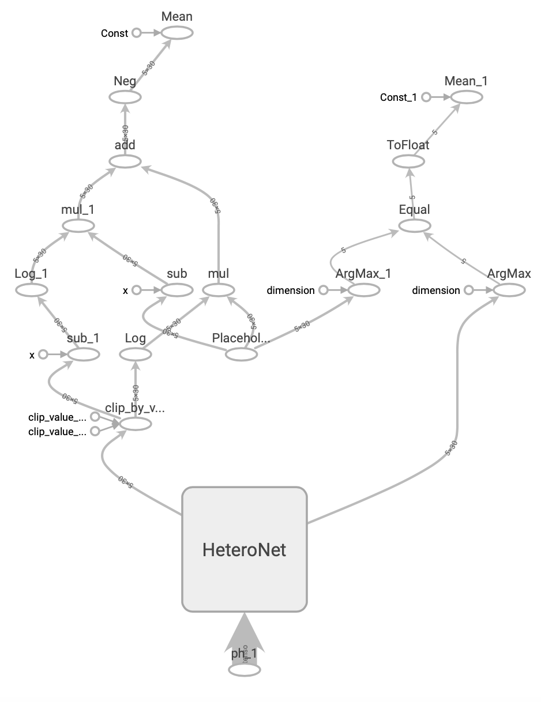
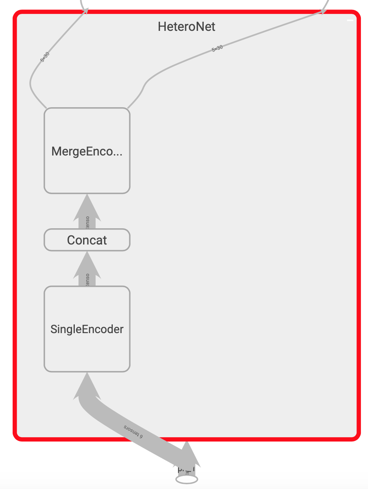
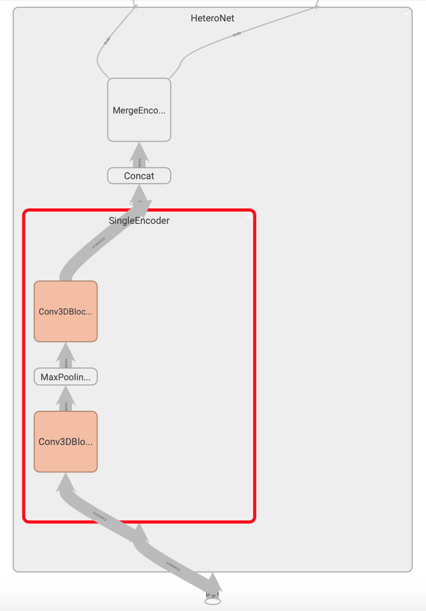
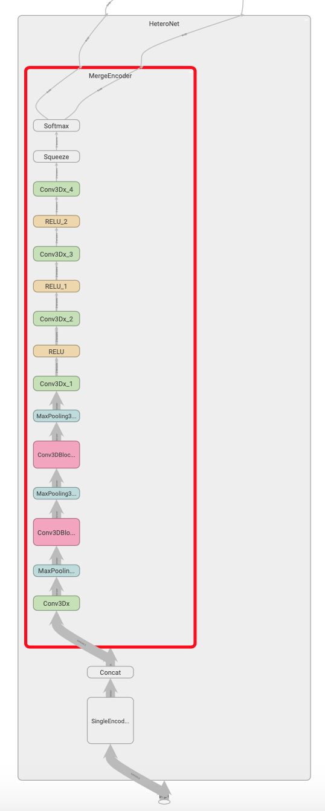

## Level 1 - HeteroNet

## Level 2
HeteroNet contains single_encoder and merged_encoder. 
Single_encoder served as image_feature_extraction from individual MRI series. 
It is a single encoder that process all input modalitlies (T1,T2,T1+C) in cropped ROI region of 4x320x320. 
Merged_encoder merges all features from all inputs for further classification. 

## Level 3 - Single Encoder

## Level 3 = Merged Encoder
